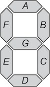
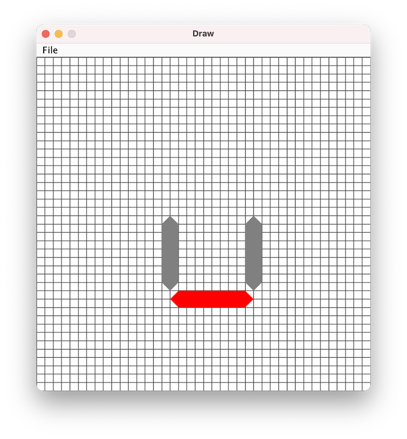

# Cronômetro e Contador regressivo
> Este documento está licenciado sob [Creative Commons "Atribuição 4.0 Internacional"](https://creativecommons.org/licenses/by/4.0/deed.pt_BR)

|Disciplina| Curso | Professor |
|-------|---------|----|
|Programação Orientada a Objetos| Engenharia de Telecomunicações|Emerson Ribeiro de Mello|

Instituto Federal de Santa Catarina, campus São José


## Display de 7 segmentos

Os [*displays* de 7 segmentos](https://pt.wikipedia.org/wiki/Display_de_sete_segmentos) são componentes eletrônicos, de baixo custo, que permitem exibir informação alfanumérica para os usuários. O *display* é composto por 7 segmentos que podem ser ligados ou desligados individualmente para que possa representar um número ou letra. 

Na figura abaixo é apresentado um exemplo do *display*, estando cada segmento identificado por uma letra. Por exemplo, se desejarmos representar o número 2 neste *display*, então teríamos que ligar somente os segmentos: A, B, G, E e D.

Fonte: Wikipedia

## Projeto a ser desenvolvido

Você deverá desenvolver um projeto em Java com gradle, usando a biblioteca [algs4](https://algs4.cs.princeton.edu/code/algs4.jar), que permita representar um cronômetro ou um contador regressivo, sendo que cada dígito do cronômetro ou contador, deverá ser representado como um *display* de 7 segmentos. 

Abaixo é apresentado um exemplo de como deverá desenhar um cronômetro ou um contador regressivo com horas, minutos e segundos usando a biblioteca [algs4](https://algs4.cs.princeton.edu/code/algs4.jar). Neste exemplo, tem-se uma contagem regressiva iniciada às `07h00m30s` tendo o segmento ligado na cor verde clara e o segmento desligado na cor verde escuro.


- Todo cronômetro é capaz de contar de 0 horas, 0 minutos e 0 segundos até 99 horas, 59 minutos e 59 segundos. 
  - Ao atingir o valor limite, o próximo valor deverá ser `00:00:00`
- O valor máximo para iniciar o contador regressivo é `99:59:59`
- Ao instanciar um cronômetro ou um contador regressivo, deve-se fornecer as coordenadas (X,Y) onde deverá ser desenhado na área de desenho (*canvas*), seu tamanho e qual será a cor dos segmentos, quando ligados ou desligados. Para o contador regressivo deve-se ainda informar a hora, minuto e segundos. Exemplos: `00h00m30s`, `00h02m30s`,`01h02m30s`.  
  - O tamanho permitido deve ser um valor de `20` a `100`, se for fornecido um valor diferentes desta faixa, então deve-se criar com o tamanho padrão `40`.
- Todo segmento desligado deverá ser desenhado como uma cor mais escura que a cor usada para desenhar um segmento ligado
- Segmento, dígito, cronômetro ou contador regressivo possuem responsabilidades distintas. Ou seja, sua modelagem deverá respeitar esta definição.
  - Não será considerada correta qualquer solução que não respeite esta divisão
- A área de desenho (*canvas*) deverá ser atualizada a cada 1 segundo, permitindo assim ao usuário visualizar o progresso ou regresso da contagem.
- Na classe com método `main` deve-se criar uma área de desenho com tamanho de 800 *pixels*. Esta classe será a responsável por invocar periodicamente (a cada 1 segundo) os métodos dos objetos cronômetro e contador regressivo para que desenhem-se e para que atualizem seus contadores
  


### Entregas e requisitos para desenvolvimento

Marque com x cada um dos itens que atendeu ao desenvolver este projeto.


- [ ] Diagrama de classes UML (perspectiva de implementação) salvo em um arquivo chamado `modelagem.png` na raiz do repositório. 
  - Você deve obrigatoriamente fazer uso de associações entre classes
- [ ] Projeto Java com gradle, indicando e provendo as dependências de bibliotecas externas. 
- [ ] Criar um arquivo `.gitignore` adequado ao projeto
- [ ] Comportamento correto do cronômetro e do contador regressivo
- [ ] Representação gráfica correta do *display*
- [ ] Teste de unidade para garantir o funcionamento esperado para cada classe (com exceção da classe com o método `main`)
  - [ ] Comentário acima de cada teste de unidade explicando o que está sendo testado
- [ ] Respeitar o encapsulamento de dados, responsabilidade única e divisão de responsabilidades
- [ ] Fazer uso correto de constantes e não ter constantes literais espalhados pelo código
- [ ] Na classe com método `main` deve-se instanciar ao menos 1 cronômetro e 1 contador regressivo, cada um com tamanhos e cores diferentes
- [ ] Comportamento correto da classe que possui método `main` com atualização da tela a cada 1 segundo para demonstrar a contagem
- [ ] Documentação dos principais métodos com JavaDOC
- [ ] É possível executar o projeto com sucesso após o mesmo ser clonado via `git clone`
  - Na correção, o professor executará a aplicação com o comando: `./gradlew run`. Caso não seja possível executá-lo, então o projeto receberá o conceito mínimo

## Material de apoio

### Contador de 0 até 10 usando a biblioteca algs4

Neste exemplo é apresentado como fazer uma rotina periódica para limpar a área de desenho (*canvas*) e desenhar o valor de um contador. Foi feito uso do método `Thread.sleep()` para fazer o aplicativo dormir por 1 segundo a cada rodada do laço para realizar uma contagem de 10 segundos.

```java
import edu.princeton.cs.algs4.Draw;

public class App{
    
    // Não iremos tratar as possíveis exceções de execução
    public static void main(String[] args) throws Exception{
        Draw desenho = new Draw();
        // dimensão da área de desenho (canvas)
        int dimensao = 800;
        desenho.setXscale(0, 800);
        desenho.setYscale(0, 800);
        // Toda ação de desenho acontecerá em um buffer secundário e este só será visto depois que for invocado o método show()
        desenho.enableDoubleBuffering();

        // Aumentando o tamanho da fonte do texto que será escrito
        Font font = desenho.getFont().deriveFont(16);
        desenho.setFont(font);

        for (int i = 0; i < 10; i++) {
            // limpando a área de desenho
            desenho.clear();
            // escrevendo o valor de i na coordenada (500,500)
            desenho.text(500, 500, ""+ i);
            // Trocando o buffer para exibir o que foi escrito
            desenho.show();
            // Dormindo por 1 segundo
            Thread.sleep(1000);
        }
    } // fim do main
}// fim da classe
```

### Desenhando polígonos preenchidos com a biblioteca algs4

Cada segmento do *display* pode ser desenhado com um [polígono](https://pt.wikipedia.org/wiki/Pol%C3%ADgono), para isto será feito uso do método [`filledPolygon(double[] x, double[] y)`](https://introcs.cs.princeton.edu/java/stdlib/javadoc/Draw.html#filledPolygon-double:A-double:A-) da classe [`Draw`](https://introcs.cs.princeton.edu/java/stdlib/javadoc/Draw.html). Abaixo é apresentada uma captura de tela obtida a partir do código Java apresentado logo após esta figura.




```java
import edu.princeton.cs.algs4.Draw;

public class App{
    
    // Não iremos tratar as possíveis exceções de execução
    public static void main(String[] args) throws Exception{
        Draw desenho = new Draw();
        // dimensão da área de desenho (canvas)
        int dimensao = 800;
        desenho.setXscale(0, 800);
        desenho.setYscale(0, 800);
        // Toda ação de desenho acontecerá em um buffer secundário e este só será visto depois que for invocado o método show()
        desenho.enableDoubleBuffering();
      
	      // determina a proporção que será usada para desenhar todos os elementos
        double fator = 200;

        // Desenhando grade quadriculada
        int grade = (int) fator/10;
        desenho.setPenColor(desenho.DARK_GRAY);
        for (int i = 0; i <= dimensao; i+=grade) desenho.line(i, 0, i, dimensao);
        for (int j = 0; j <= dimensao; j+=grade) desenho.line(0, j, dimensao, j);

        double xInicial = 300;
        double yInicial = 400;

        // ---------------------------------------- //
        // Montando vetores com os pontos em X e em Y para desenhar um segmento horizontal
        yInicial = 180;
        double[] xHorizontal = {0.1*fator+xInicial, 0.2*fator+xInicial, 1.0*fator+xInicial, 1.1*fator+xInicial, 1.0*fator+xInicial, 0.2*fator+xInicial};
        double[] yHorizontal = {0.2*fator+yInicial, 0.3*fator+yInicial, 0.3*fator+yInicial, 0.2*fator+yInicial, 0.1*fator+yInicial, 0.1*fator+yInicial};

        desenho.setPenColor(desenho.RED);
        desenho.filledPolygon(xHorizontal, yHorizontal);
        // ---------------------------------------- //

        // ---------------------------------------- //
        // Montando vetores com os pontos em X e em Y para desenhar um segmento vertical
        yInicial = 200;
        double[] xVertical = {0.1*fator+xInicial, 0.2*fator+xInicial, 0.2*fator+xInicial, 0.1*fator+xInicial, 0*fator+xInicial, 0*fator+xInicial};
        double[] yVertical = {0.2*fator+yInicial, 0.3*fator+yInicial, 1.0*fator+yInicial, 1.1*fator+yInicial, 1.0*fator+yInicial, 0.3*fator+yInicial};

        desenho.setPenColor(desenho.GRAY);
        desenho.filledPolygon(xVertical, yVertical);

        // Desenhando outro segmento vertical com um espaço de 200 pixels em X
        for (int i = 0; i < xVertical.length; i++) {
            xVertical[i]+=200;
        }
        desenho.filledPolygon(xVertical, yVertical);
        // ---------------------------------------- //

        // Trocando o buffer para exibir o que foi desenhado
        desenho.show();
    } // fim do main
}// fim da classe
```